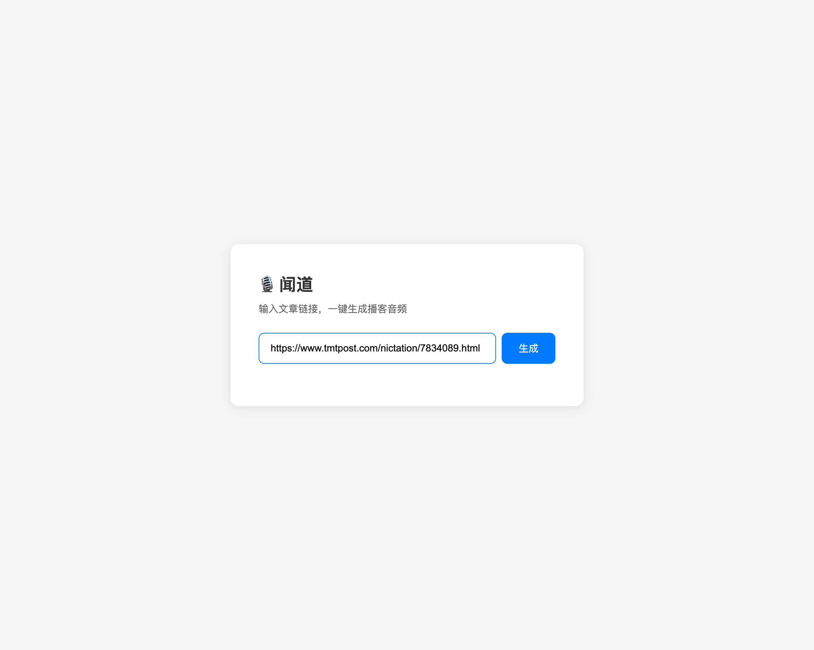
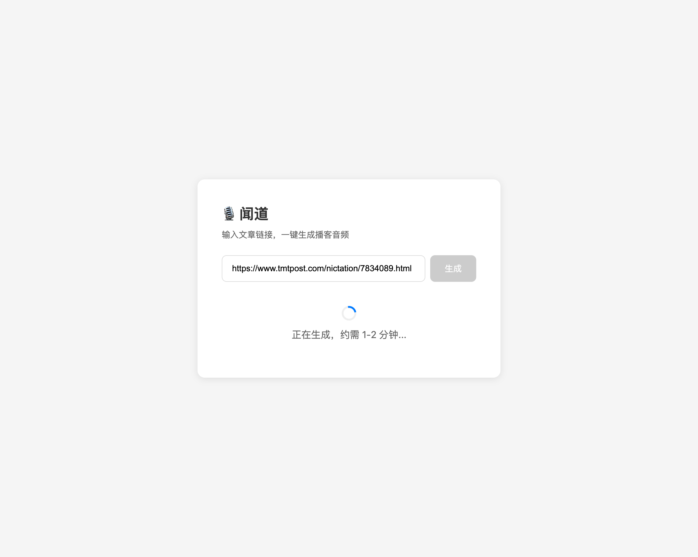
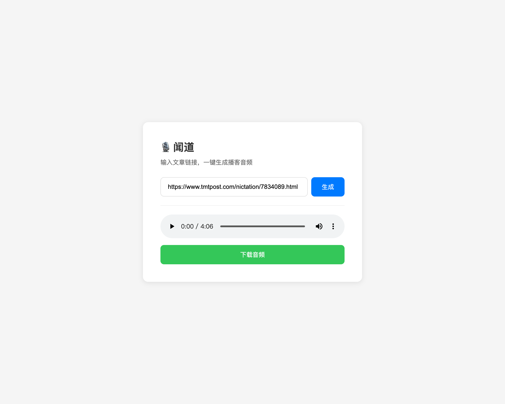
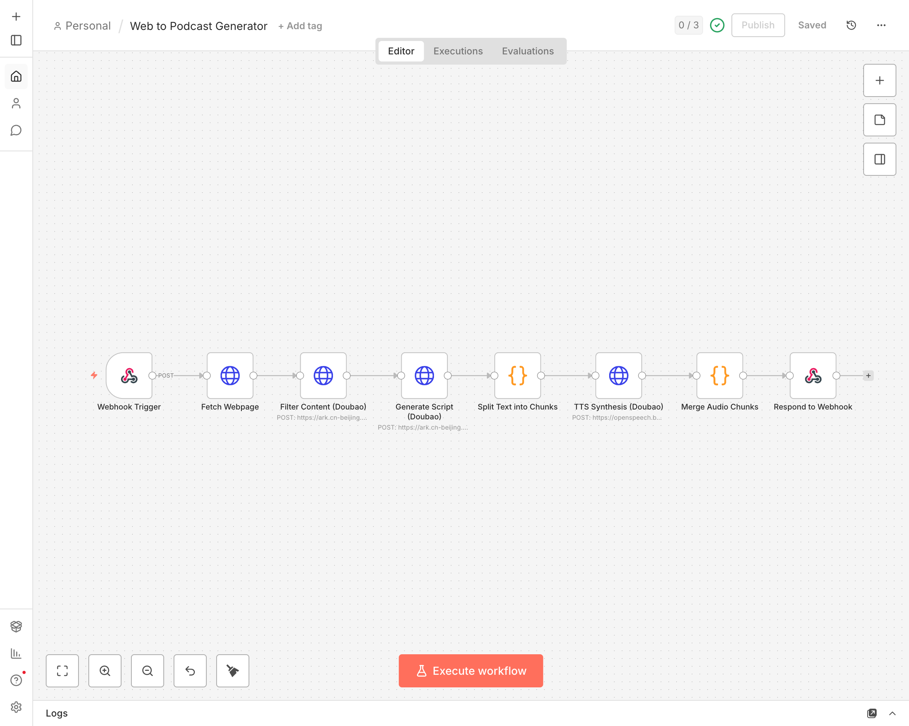

# 🎙️ 闻道 - 网页转播客生成器

> **朝闻道，夕可听也** —— 将任意网页文章一键转换为高质量播客音频

基于 n8n 和豆包 API 的自动化网页转播客系统，让阅读变成聆听。

## ✨ 功能特性

- 🔍 **智能内容提取**：自动过滤广告、导航等无效内容，精准提取文章正文
- 📝 **播客脚本生成**：AI 将文章改写为口语化播客脚本，自然流畅
- 🎤 **高质量语音合成**：使用豆包 TTS API 生成媲美真人的语音
- ⚡ **一键生成**：输入 URL，等待 1-2 分钟即可获得播客音频
- 🔄 **自动化工作流**：基于 n8n 的可视化工作流，易于定制和扩展

## 📸 使用演示

### 1. 输入文章链接


### 2. 等待生成（约 1-2 分钟）


### 3. 播放或下载音频


### 4. n8n 工作流


## 🛠️ 技术栈

| 组件 | 说明 |
|------|------|
| **n8n** | 开源工作流自动化平台 |
| **豆包 Chat API** | 字节跳动大模型，用于内容提取和脚本生成 |
| **豆包 TTS API** | 高质量语音合成服务 |
| **Python** | 简易 Web 服务器 |

## 安装指南

### 1. 安装 Node.js

#### macOS

```bash
# 使用 Homebrew 安装
brew install node

# 或使用 nvm（推荐，便于版本管理）
curl -o- https://raw.githubusercontent.com/nvm-sh/nvm/v0.39.7/install.sh | bash
source ~/.zshrc
nvm install 20
nvm use 20
```

#### Ubuntu/Debian

```bash
# 使用 NodeSource 安装
curl -fsSL https://deb.nodesource.com/setup_20.x | sudo -E bash -
sudo apt-get install -y nodejs
```

#### Windows

从 [Node.js 官网](https://nodejs.org/) 下载 LTS 版本安装包并运行。

验证安装：

```bash
node -v  # 应显示 v16.x 或更高版本
npm -v
```

### 2. 安装 n8n

#### 方式一：全局安装（推荐）

```bash
npm install n8n -g
```

#### 方式二：使用 Docker

```bash
docker run -it --rm \
  --name n8n \
  -p 5678:5678 \
  -v ~/.n8n:/home/node/.n8n \
  n8nio/n8n
```

#### 方式三：使用 npx（无需安装）

```bash
npx n8n
```

启动 n8n：

```bash
n8n start
# 或后台运行
n8n start &
```

访问 `http://localhost:5678` 进入 n8n 界面。

### 3. 安装 ffmpeg

#### macOS

```bash
brew install ffmpeg
```

#### Ubuntu/Debian

```bash
sudo apt update
sudo apt install ffmpeg
```

#### Windows

1. 从 [ffmpeg 官网](https://ffmpeg.org/download.html) 下载 Windows 版本
2. 解压到 `C:\ffmpeg`
3. 将 `C:\ffmpeg\bin` 添加到系统环境变量 PATH

验证安装：

```bash
ffmpeg -version
```

### 4. 克隆项目

```bash
git clone https://github.com/your-username/wendao.git
cd wendao

# 创建输出目录
mkdir -p output
```

## 快速开始

### 1. 前置要求

- Node.js >= 16（已安装）
- n8n（已安装并运行）
- ffmpeg（已安装）
- 豆包 API 账号（火山方舟平台）

### 2. 获取豆包 API 凭证

#### 2.1 注册火山引擎账号

1. 访问 [火山引擎官网](https://www.volcengine.com/)
2. 点击右上角「注册」，完成账号注册
3. 完成实名认证（必须，否则无法使用 API）

#### 2.2 获取 Chat API 凭证（DOUBAO_API_KEY 和 DOUBAO_ENDPOINT_ID）

1. 访问 [火山方舟控制台](https://console.volcengine.com/ark)
2. 首次使用需开通服务，点击「立即开通」
3. **创建 API Key**：
   - 进入「API Key 管理」页面
   - 点击「创建 API Key」
   - 复制生成的 API Key（格式如：`xxxxxxxx-xxxx-xxxx-xxxx-xxxxxxxxxxxx`）
   - ⚠️ API Key 只显示一次，请妥善保存
4. **创建推理接入点（Endpoint）**：
   - 进入「模型推理」→「推理接入点管理」
   - 点击「创建推理接入点」
   - 选择模型：推荐 `Doubao-pro-32k` 或 `Doubao-lite-32k`
   - 填写接入点名称，点击「确定」
   - 复制 Endpoint ID（格式如：`ep-20240101-xxxxx`）

#### 2.3 获取 TTS API 凭证（V3 API）

1. 访问 [豆包语音控制台](https://console.volcengine.com/speech/app)
2. 首次使用需开通「**语音合成大模型**」服务（注意：不是普通的「语音合成」）
3. **创建应用**：
   - 点击「创建应用」
   - 填写应用名称（如：`podcast-generator`）
   - 服务类型选择「**语音合成大模型**」
   - 点击「确定」创建
4. **获取 App ID**：
   - 在应用列表中，直接查看「App ID」列
   - 复制数字 ID（如：`123456789`）→ 这就是 `DOUBAO_TTS_APP_ID`
5. **获取 Access Token**：
   - 在应用列表中，点击对应应用的「查看」按钮
   - 进入应用详情页
   - 找到「Access Token」字段，点击复制
   - 这就是 `DOUBAO_TTS_ACCESS_TOKEN`

> **注意**：App ID 和 Access Token 是一一对应的，确保使用同一个应用的凭证。

#### 2.4 选择 TTS 模型版本

| Resource ID | 模型版本 | API 版本 | 价格 | 说明 |
|-------------|---------|---------|------|------|
| `seed-tts-1.0` | 豆包语音合成 1.0（字符版） | V1 | **2 元/万字符** | 便宜，基础功能 |
| `seed-tts-1.0-concurr` | 豆包语音合成 1.0（并发版） | V1 | 按并发计费 | 高并发场景 |
| `seed-tts-2.0` | **豆包语音合成 2.0** | V3 | **3 元/万字符** | 支持语音指令、情感控制 |
| `seed-icl-1.0` | 声音复刻 1.0 | V3 | 3 元/万字符 | 克隆音色 |
| `seed-icl-2.0` | 声音复刻 2.0 | V3 | 3 元/万字符 | 新版克隆 |

> **提示**：工作流会根据 `DOUBAO_TTS_RESOURCE_ID` 自动选择对应的 API 版本：
> - 包含 `1.0` → 使用 V1 HTTP API（`https://openspeech.bytedance.com/api/v1/tts`）
> - 其他 → 使用 V3 HTTP API（`https://openspeech.bytedance.com/api/v3/tts/unidirectional`）

#### 2.5 凭证汇总

获取完成后，你应该有以下值：

| 环境变量 | 来源 | 格式示例 |
|---------|------|---------|
| `DOUBAO_API_KEY` | 火山方舟 API Key 管理 | `xxxxxxxx-xxxx-xxxx-xxxx-xxxxxxxxxxxx` |
| `DOUBAO_ENDPOINT_ID` | 火山方舟推理接入点 | `ep-20240101-xxxxx` |
| `DOUBAO_TTS_APP_ID` | 语音技术控制台 App ID | `123456789` |
| `DOUBAO_TTS_ACCESS_TOKEN` | 语音技术控制台 Access Token | `your-access-token` |
| `DOUBAO_TTS_RESOURCE_ID` | TTS 模型版本 | `seed-tts-2.0`（默认） |

### 3. 配置项目

1. 复制 `.env.example` 为 `.env`：
   ```bash
   cp .env.example .env
   ```
2. 编辑 `.env` 文件，填写你的 API 凭证。

### 4. 启动 n8n

运行启动脚本：
```bash
./start-n8n.sh
```

### 5. 导入 n8n 工作流

1. 打开 n8n 控制台（默认 http://localhost:5678）。
2. 点击 "Import from file"，选择项目根目录下的 `workflow.json`。

### 6. 配置 Prompt

工作流中的三个关键节点需要手动配置 Prompt：

#### Node: Filter Content (Doubao)
将 `prompts/content_filter.txt` 的内容复制到该节点的 `messages` 参数中。

#### Node: Generate Script (Doubao)
将 `prompts/script_generation.txt` 的内容复制到该节点的 `messages` 参数中。

#### Node: Select Voice Tone (Doubao)
将 `prompts/voice_selection.txt` 的内容复制到该节点的 `messages` 参数中。

### 7. 启动工作流

1. 在 n8n 中激活工作流
2. 复制 Webhook URL（如：`http://localhost:5678/webhook/generate-podcast`）
3. 发送 POST 请求测试：

```bash
curl -X POST http://localhost:5678/webhook/generate-podcast \
  -H "Content-Type: application/json" \
  -d '{"url": "https://example.com/article"}'
```

## 工作流程

```
用户输入 URL
    ↓
抓取网页内容
    ↓
豆包 API：过滤无效内容
    ↓
豆包 API：生成播客脚本
    ↓
豆包 API：选择音色类型
    ↓
脚本分段（每500字）
    ↓
豆包 TTS：批量生成音频
    ↓
ffmpeg：拼接音频文件
    ↓
返回播客文件路径
```

## 音色类型

### 豆包语音合成模型 2.0（推荐）

| 音色名称 | voice_type | 适用场景 |
|---------|------------|---------|
| Vivi 2.0 | `zh_female_vv_uranus_bigtts` | 通用场景 |
| 小何 2.0 | `zh_female_xiaohe_uranus_bigtts` | 通用场景 |
| 云舟 2.0 | `zh_male_m191_uranus_bigtts` | 通用场景 |
| 小天 2.0 | `zh_male_taocheng_uranus_bigtts` | 通用场景 |

### 豆包语音合成模型 1.0

| 音色名称 | voice_type | 适用场景 |
|---------|------------|---------|
| 清新男声 | `zh_male_qingxinnansheng_moon_bigtts` | 新闻、财经 |
| 温暖男声 | `zh_male_wennuannansheng_moon_bigtts` | 科技、产品 |
| 湾湾小何 | `zh_female_wanwanxiaohe_moon_bigtts` | 故事、生活 |
| 活泼女声 | `zh_female_huopoqinglang_moon_bigtts` | 娱乐、时尚 |

### 定价对比

| 模型版本 | 后付费单价 | 资源包最低价 |
|---------|-----------|-------------|
| 1.0 | 2 元/万字符 | 1.8 元/万字符 |
| 2.0 | 3 元/万字符 | 2.8 元/万字符 |

> **提示**：1.0 模型价格便宜约 33%，2.0 模型支持语音指令和情感控制。

## Prompt 工程说明

### 1. 内容过滤 Prompt
- **目标**：去除广告、导航等噪音
- **策略**：明确列出需要过滤的元素类型
- **验证**：检查输出是否少于100字（内容不足判断）

### 2. 脚本生成 Prompt
- **目标**：生成自然流畅的口语化脚本
- **策略**：
  - 添加语气词（嗯、其实、你知道吗）
  - 控制句子长度（≤30字）
  - 增加过渡词和引导语
- **约束**：禁止音效描述、背景音乐提示

### 3. 音色选择 Prompt
- **目标**：根据内容类型自动选择音色
- **策略**：
  - 分析内容主题
  - 判断语言风格
  - 识别目标受众
- **输出**：仅返回音色代码（无解释）

## 故障排查

### 问题 1：TTS API 返回 401 错误
**原因**：App ID 或 Access Token 配置错误
**解决**：
- 检查 `DOUBAO_TTS_APP_ID` 和 `DOUBAO_TTS_ACCESS_TOKEN` 是否正确
- 确保 App ID 和 Access Token 来自同一个应用
- 确认已开通「语音合成大模型」服务

### 问题 2：音频拼接失败
**原因**：ffmpeg 未安装或路径错误
**解决**：
```bash
# macOS
brew install ffmpeg

# Ubuntu
sudo apt install ffmpeg
```

### 问题 3：内容提取为空
**原因**：网页需要 JavaScript 渲染
**解决**：在 "Fetch Webpage" 节点中启用 Headless Browser 选项

### 问题 4：脚本生成质量差
**原因**：Prompt 不够精确
**解决**：调整 `prompts/script_generation.txt`，增加示例或约束条件

## 成本估算

基于豆包 API 2026 年定价：

- **Chat API**：¥0.0012/千 tokens（pro-32k 模型）
- **TTS API 1.0**：¥0.02/千字符（2 元/万字符）
- **TTS API 2.0**：¥0.03/千字符（3 元/万字符）

**单次播客成本**（1000 字文章，生成约 1200 字脚本）：

| 项目 | 1.0 模型 | 2.0 模型 |
|------|---------|---------|
| 内容过滤 | ~¥0.002 | ~¥0.002 |
| 脚本生成 | ~¥0.003 | ~¥0.003 |
| 音色选择 | ~¥0.001 | ~¥0.001 |
| TTS 合成 | ~¥0.024 | ~¥0.036 |
| **总计** | **~¥0.03/篇** | **~¥0.042/篇** |

## 优化建议

1. **批量处理**：使用 n8n 的 Schedule 节点定时抓取 RSS 订阅
2. **缓存机制**：对相同 URL 的内容进行缓存，避免重复调用
3. **质量控制**：在脚本生成后增加人工审核节点（Wait for Webhook）
4. **音频后期**：集成降噪、音量归一化等处理

## 项目结构

```
.
├── workflow.json           # n8n 工作流配置
├── .env.example            # 环境变量模板
├── .env                    # 实际环境变量（需自行创建）
├── start-n8n.sh            # n8n 启动脚本（含环境变量）
├── prompts/                # Prompt 模板目录
│   ├── content_filter.txt
│   ├── script_generation.txt
│   └── voice_selection.txt
├── output/                 # 生成的播客文件
├── .n8n/                   # n8n 数据目录（自动生成）
└── README.md
```

## 许可证

MIT

## 参考资料

- [豆包 API 文档](https://www.volcengine.com/docs/82379)
- [n8n 官方文档](https://docs.n8n.io/)
- [火山方舟控制台](https://console.volcengine.com/ark)
